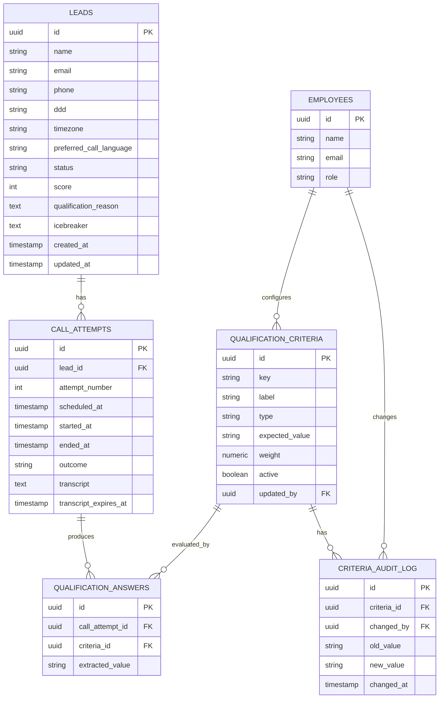

# Solar lead qualification system — technical specification

## 1. Overview

A lead qualification system for a solar energy company. Customers reach a bilingual (EN/PT) landing page, request contact, and receive an AI-conducted phone call that qualifies them as a sales lead. Employees review qualified leads and configure the qualification criteria in a dedicated portal.

## 2. Actors

- **Customer** — visits the landing page and requests contact.
- **AI voice agent** — places the qualification call.
- **Employee** — reviews leads and configures qualification criteria (agent or admin role).

## 3. Customer flow

1. Customer visits the landing page (available in English and Portuguese).
2. Customer submits the contact form: name, phone, email, and preferred call language (EN/PT, defaults to PT if not set).
3. The form is protected by rate limiting and CAPTCHA.
4. The system checks for an existing lead with the same phone number before creating a new record (deduplication key: phone).

## 4. System (AI call) flow

1. The intake API validates and stores the lead, then schedules the first call attempt.
2. Call attempts are only scheduled within an **8:00–22:00 window**, calculated in the lead's local timezone (derived from the phone number's area code / DDD — Brazil spans four timezones).
3. The voice bridge service places the call via Twilio (Media Streams) and connects the audio to the Gemini Live API, using the prompt, guardrail set, and TTS voice matching `preferred_call_language` (default `pt`).
4. The agent follows a structured qualification script and enforces the guardrails in Section 6 throughout the call.
5. **Retry policy**: up to 2 retries if unanswered — 15 minutes after attempt 1, and 2 days after attempt 2. If a calculated retry time falls outside the 8:00–22:00 window, it is pushed to the next allowed time. Interval counters run from the actual time of the previous attempt, not the originally scheduled time. A call that connects but ends before enough information is gathered is treated the same as "no answer" for retry purposes.
6. After the call ends, a separate **scoring worker** (a different, non-realtime model from the one that ran the conversation) reads the transcript, extracts structured answers, and applies the deterministic criteria configured by employees to compute a score, a qualification reason, and an icebreaker.
7. The lead record, call attempt, transcript, and score are persisted.

## 5. Employee flow

1. Employee logs into the portal.
2. Dashboard lists leads with: name, phone, email, score, reason, icebreaker, and status.
3. Employee configures qualification criteria (deterministic rules used by the scoring worker).
4. Every change to criteria is recorded in an audit log (who changed what, when, previous vs. new value).

## 6. Guardrails

The AI agent must:

- Identify itself as an AI agent at the start of the call.
- Never provide prices, quotes, or savings percentages.
- Never promise installation timelines or crew availability.
- Never make specific technical claims (equipment brand, system power, warranty terms).
- Never give financial advice (financing, installments, ROI).
- Never confirm or compare against competitors.
- Never use artificial urgency or pressure language.
- Never collect unnecessary sensitive data (full ID numbers, banking details).
- End the call gracefully, without escalating, if the lead becomes hostile or abusive.
- End the call and flag for retry if it detects that a minor answered.
- Redirect any out-of-scope question to "a specialist will follow up."
- **Immediately mark the lead as opt-out and stop all future outreach if the lead asks not to be contacted again — this takes priority over every other guardrail.**

## 7. Lead status lifecycle

```
new → calling → waiting_retry → no_answer_final → qualified | disqualified
                                                  → opt_out (can occur at any point)
```

## 8. Database schema



Notes:
- `leads.phone` carries a unique index for deduplication.
- `leads.status` is one of: `new`, `calling`, `waiting_retry`, `no_answer_final`, `qualified`, `disqualified`, `opt_out`.
- `call_attempts.outcome` is one of: `answered`, `no_answer`, `voicemail`, `busy`, `failed`.
- `call_attempts.transcript_expires_at` = `created_at` + 12 months, used by a scheduled cleanup job. Call audio is not stored in this phase.

## 9. Architecture components

- **Frontend (Next.js)** — bilingual landing page and employee portal. Deployable on Vercel's free tier.
- **Intake API (Next.js API routes)** — form validation, CAPTCHA/rate limiting, phone-based deduplication, lead creation.
- **Scheduler** — checks leads in `waiting_retry` status and dispatches calls within the allowed window, using a DDD → timezone lookup table.
- **Voice bridge** — a small Node/Fastify service (Render/Railway/Fly.io free tier) that handles the Twilio webhook and Media Streams, bridging call audio to the Gemini Live API for the realtime conversation. Needs a persistent WebSocket connection, which is why it runs separately from the Next.js serverless functions.
- **Scoring worker** — background job that runs after each call ends: extracts structured answers from the transcript, applies the deterministic criteria/weights to compute the score, and generates the qualification reason and icebreaker via a lightweight, non-realtime LLM pass.
- **Database** — PostgreSQL (e.g., Supabase free tier).

## 10. Data retention

Transcripts are retained for 12 months from the call date, then purged by a scheduled cleanup job. Call audio is not stored in this phase.
